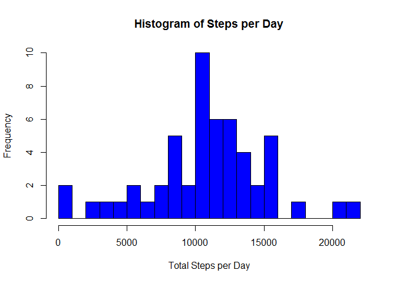
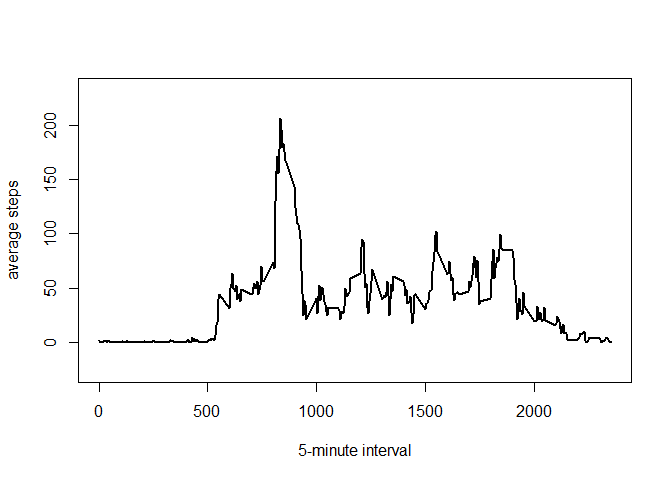
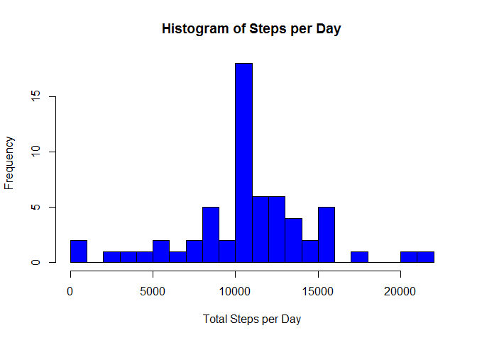

# Reproducible Research: Peer Assessment 1

Before starting the whole process, first need to **set current working directory to the folder containing the data file "activity.csv"** .

## Loading and preprocessing the data

For **loading the data**, I use the read.csv function.


```r
activity <- read.csv("activity.csv")
```

The loaded data frame contains 17568 rows of observations for 3 variables, "steps", "date" and "interval". The "date" variable is a factor variable, the other two are integer variables. 


```r
head(activity)
```

```
##   steps       date interval
## 1    NA 2012-10-01        0
## 2    NA 2012-10-01        5
## 3    NA 2012-10-01       10
## 4    NA 2012-10-01       15
## 5    NA 2012-10-01       20
## 6    NA 2012-10-01       25
```

```r
summary(activity)
```

```
##      steps                date          interval     
##  Min.   :  0.00   2012-10-01:  288   Min.   :   0.0  
##  1st Qu.:  0.00   2012-10-02:  288   1st Qu.: 588.8  
##  Median :  0.00   2012-10-03:  288   Median :1177.5  
##  Mean   : 37.38   2012-10-04:  288   Mean   :1177.5  
##  3rd Qu.: 12.00   2012-10-05:  288   3rd Qu.:1766.2  
##  Max.   :806.00   2012-10-06:  288   Max.   :2355.0  
##  NA's   :2304     (Other)   :15840
```

## What is mean total number of steps taken per day?

**In order to obtain the total numbers of steps taken per day, the aggregate function is used to generate a new data frame called step_day**. Note, days with steps all equal NA are not included, so there are a total of 53 rows in this data frame. In the new data frame, the variable steps show the sum of steps taken per day at a particular day. 


```r
step_day <- aggregate(steps ~ date, sum, data = activity)
head(step_day)
```

```
##         date steps
## 1 2012-10-02   126
## 2 2012-10-03 11352
## 3 2012-10-04 12116
## 4 2012-10-05 13294
## 5 2012-10-06 15420
## 6 2012-10-07 11015
```

**To generate a histogram plot of the data, I use the base plot system.** 

```r
hist(step_day$steps, xlab = ("Total Steps per Day"), main = "Histogram of Steps per Day", col="blue", breaks = 20)
```

 

Here the total step taken per day shows a pretty wide range, so increase the number of breaks in the plot to 20 gives a better representation of the data.

To obtain the mean and median of the total steps taken per day, one can simply call the summary function on the data frame step_day.


```r
summary(step_day)
```

```
##          date        steps      
##  2012-10-02: 1   Min.   :   41  
##  2012-10-03: 1   1st Qu.: 8841  
##  2012-10-04: 1   Median :10765  
##  2012-10-05: 1   Mean   :10766  
##  2012-10-06: 1   3rd Qu.:13294  
##  2012-10-07: 1   Max.   :21194  
##  (Other)   :47
```

As we can see from the results, **the mean and median of the steps taken per day are 10766 and 10765 steps**, respectively.

## What is the average daily activity pattern?

To generate **a data frame for the average steps taken per 5-minute interval, I again use the aggregate function**. The new data frame is named ave_step.


```r
ave_step <- aggregate(steps ~ interval, mean, data = activity)
head(ave_step)
```

```
##   interval     steps
## 1        0 1.7169811
## 2        5 0.3396226
## 3       10 0.1320755
## 4       15 0.1509434
## 5       20 0.0754717
## 6       25 2.0943396
```

Once the data frame is readily generated, a plot can be made. Here I use the base plot system again.


```r
plot(ave_step$interval, ave_step$steps, type = "l", xlab = "5-minute interval", ylab= "average steps", asp = 5, lwd = 2)
```

 

To find out the maximum number of average steps taken in a given 5-minute interval and which row this is in the data frame, I use the max and which.max functions.


```r
max(ave_step$steps)
```

```
## [1] 206.1698
```

```r
which.max(ave_step$steps)
```

```
## [1] 104
```

```r
ave_step[which.max(ave_step$steps),1]
```

```
## [1] 835
```

From the results we can see that the **maximum value of the averaged steps taken in a given 5-minute interval is 206.1698 steps, and the time interval is at 8:35 in the morning**.


## Imputing missing values

To find how many NAs there are in the data set, I use the is.na function.


```r
sum(is.na(activity$steps))
```

```
## [1] 2304
```

From the results, we can see that **a total of 2304 rows contain NA in the activity data frame**.

In order **to fill in the NA with the mean value for steps for the same time interval**, the easiest way would be first to create a vector called temp_1 here, with values taken from the second column of ave_step data frame, repeated for 61 times to generate the 17568 rows matching the original data frame. Then to substitue the value using an intermediate logic variable called temp_2. 


```r
temp_1 <- rep(ave_step[,2], 61)
temp_2 <- is.na(activity$steps)
activity_2 <- activity
activity_2[temp_2,1] <- temp_1[temp_2]
head(activity_2)
```

```
##       steps       date interval
## 1 1.7169811 2012-10-01        0
## 2 0.3396226 2012-10-01        5
## 3 0.1320755 2012-10-01       10
## 4 0.1509434 2012-10-01       15
## 5 0.0754717 2012-10-01       20
## 6 2.0943396 2012-10-01       25
```
With this operation, the NA in the steps variable in the activity_2 data frame, which is an identical copy of the original activity data frame, would have been replaced by the mean steps value for that particular 5-mintue interval.

To find out the **total number of steps taken each day**, I again use the aggregate function. Histogram plot generated using the same method described above. Note with the NAs filled in with real value, now the step_day_2 data frame has 61 rows, compared to the 53 rows of step_day data frame before filling NAs.


```r
step_day_2 <- aggregate(steps ~ date, sum, data = activity_2)
hist(step_day_2$steps, xlab = ("Total Steps per Day"), main = "Histogram of Steps per Day", col="blue", breaks = 20)
```

 

Again to obtain the mean and median values of the total steps taken per day, we can call the summary function on the step_day_2 data frame.


```r
summary(step_day_2)
```

```
##          date        steps      
##  2012-10-01: 1   Min.   :   41  
##  2012-10-02: 1   1st Qu.: 9819  
##  2012-10-03: 1   Median :10766  
##  2012-10-04: 1   Mean   :10766  
##  2012-10-05: 1   3rd Qu.:12811  
##  2012-10-06: 1   Max.   :21194  
##  (Other)   :55
```

As we can see, the **mean and median are now the same, 10766 steps per day**. This set of newly computed numbers are very close to the original number reported in part one of this project, which makes sense since we replaced NA with the average value of that time interval over different days. We can expect when adding two groups of numbers with the same average and median, the new larger group of numnbers would have the same mean and median as the two smaller groups. This is what's happening here.

## Are there differences in activity patterns between weekdays and weekends?

Here I create **a new factor variable called wday, which has two levels indicating whether a particular date is a weekend or a weekday**. Function weekdays is used.


```r
wday_test <- weekdays(as.Date(activity$date))
wday <- as.factor(wday_test)
levels(wday) <- c("weekday","weekday", "weekend", "weekend", "weekday","weekday","weekday")
```

After creating the factor variable wday, combine it with the previously generated activity_2 data frame which has all NAs filled to create a new data frame called activity_3. Then again use aggregate function to caculate the mean steps in time intervals for weekends and weekdays respectively, and store the results in a new data frame called ave_step_wday. Finally, use the lattice plot package, call the xyplot function to create the required panel plot.


```r
activity_3 <- cbind(activity_2, wday)
ave_step_wday <- aggregate(steps~interval+wday, mean, data = activity_3)
library(lattice)
xyplot(steps~interval|wday, data = ave_step_wday, type = "l", layout = c(1,2))
```

 

From the resulting plot we can see a clear difference in the behavior between weekdays and weekends. In weekdays the most activity occurs around the rush hours while midday activity level is lower. For weekends the activity starts at a later time and occurs throughout the day.


